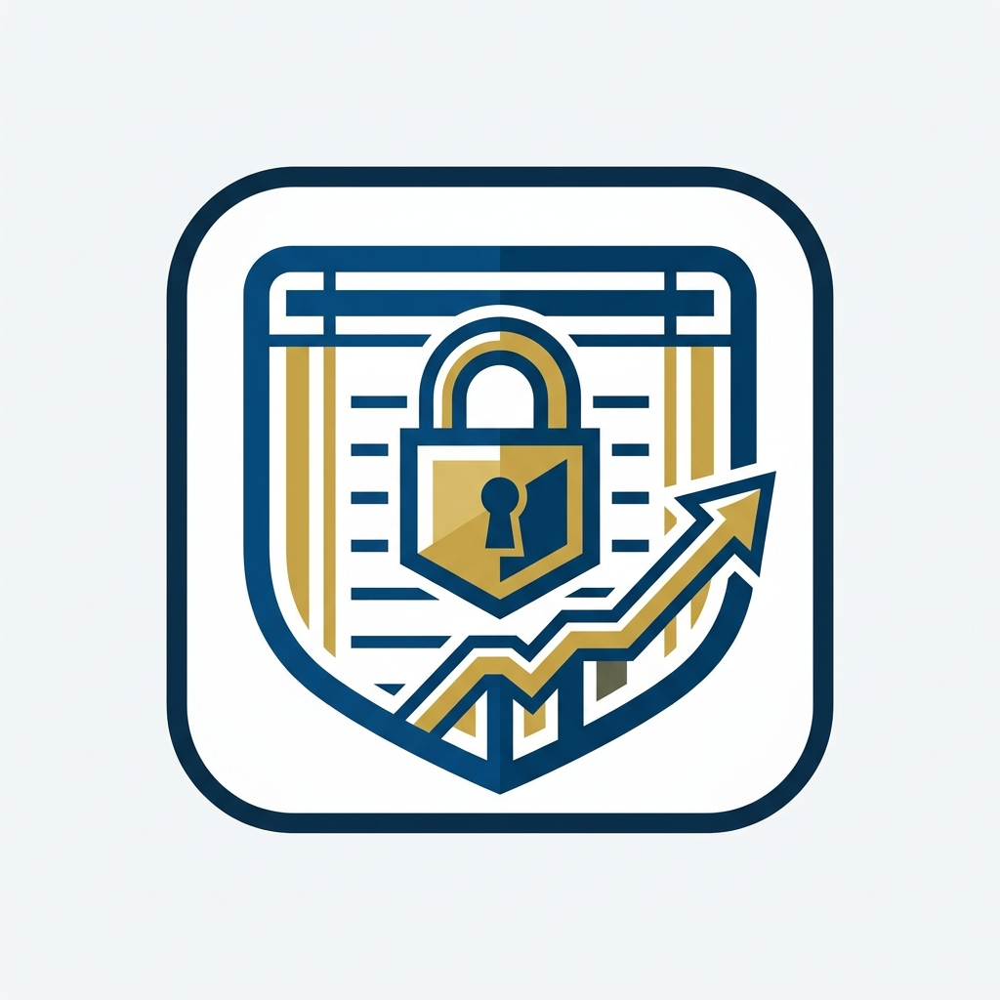

<div align="center">
  
  <h1>TrustLedger</h1>
  <p><strong>A Professional Financial Management & Plot Installment Tracking Software</strong></p>
</div>

---

## 📌 Overview

**TrustLedger** is a sleek, reliable, and secure standalone desktop application designed for real estate and plot installment management. It provides comprehensive tools for tracking director shares, customer plot details, installments, and petty cash.

## ✨ Key Features

- **📊 Advanced Financial Reporting:** Generate beautifully formatted Daily Cash Flow, Bank Transaction, and Monthly Summary reports. Export directly to Excel or print them instantly to PDF.
- **💼 Director & Share Management:** Easily manage stakeholders, their property shares, value, and track distributed payments over time.
- **👥 Customer Tracking:** Complete profiles for customers, plot details, their total due amounts, and monthly installment trackers.
- **💰 Ledger & Petty Cash:** Maintain clear logs of daily Income, Expense, and Bank deposits/withdrawals with an intuitive dashboard.
- **🔐 Secure Admin Controls:** Password-protected operations with a smooth 30-minute session authentication flow to prevent unauthorized deletions.
- **🔄 Instant Cloud Backup:** Automated Telegram bot integration sends a backup copy of your database to a secure channel every time a modification is made.
- **📂 Multi-Project Support:** Need to manage a separate sister project? Easily switch between completely isolated project databases with the built-in Profile Switcher.

## 🚀 Getting Started

### Prerequisites

Ensure you have Python 3.8+ installed on your system.

### Installation

1. **Clone the repository:**
   ```bash
   git clone https://github.com/pythonicshariful/TrustLedger.git
   cd TrustLedger
   ```

2. **Install the dependencies:**
   ```bash
   pip install -r requirements.txt
   ```

3. **Run the application (Web Mode):**
   ```bash
   python app.py
   ```

4. **Run the application (Desktop App Mode):**
   ```bash
   python run_gui.py
   ```
   *Note: This will open TrustLedger in a clean desktop window wrapper.*

### Building the Executable

To compile TrustLedger into a standalone `.exe` file that doesn't require Python to be installed:
```bash
python build_exe.py
```
*The final executable will be located in the `dist/` folder.*

## ⚙️ Configuration

- **Admin Password:** You can change the default admin password in `admin_config.json`.
- **Telegram Backups:** Configure your `BOT_TOKEN` and `CHAT_ID` inside `telegram_utils.py` to enable automatic cloud backups.

---
*Built for speed, security, and precision.*
